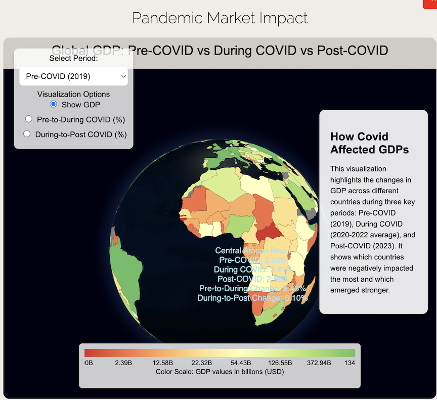
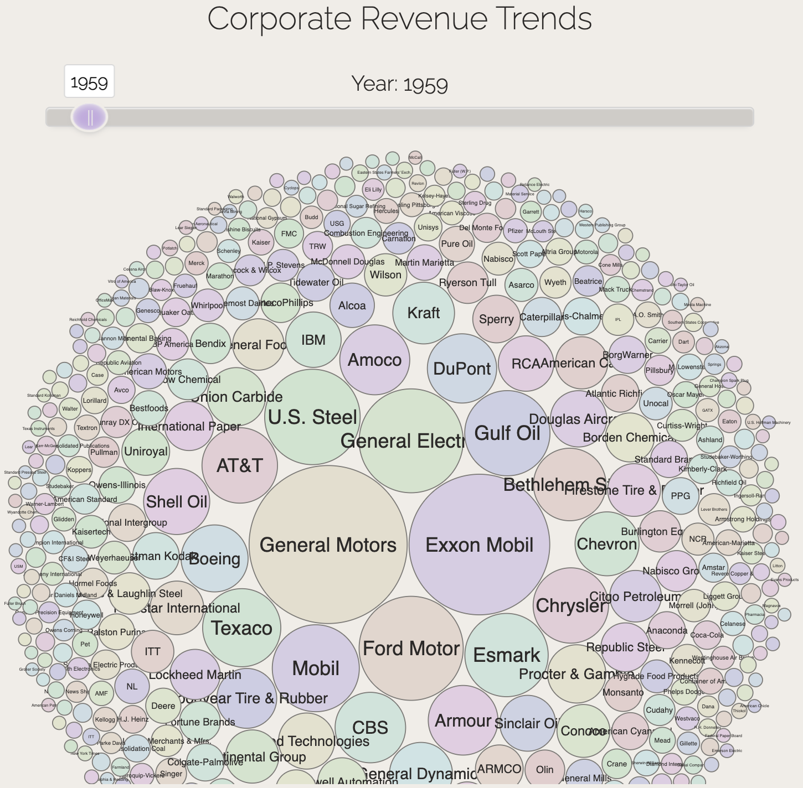

# Impact of Global Events on Market Trends

This project explores the **relationships between global events** (e.g., wars, pandemics, and energy shifts) and their impact on stock markets, GDP trends, and energy performance, using interactive visualizations built with **Observable** and **Plotly.js**.

---

## Key Features

1. **Interactive Graphs**:
    - **COVID-19 Impact**: Visualize changes in GDP across countries during the pandemic.
    - **War Trends**: Analyze defense sector stock performance during major conflicts.
    - **Energy Performance**: Compare clean and dirty energy performance over time.

2. **Geospatial Visualizations**:
    - Map-based representations of GDP and other economic indicators.
    - Highlight regions affected by specific global events.

3. **Real-Time Interactivity**:
    - Dynamic sliders and selectors for filtering time ranges.
    - Toggle visibility for individual data sets (e.g., clean vs. dirty energy).

4. **Data-Driven Insights**:
    - Aggregated data from diverse sources (e.g., GDP trends, energy markets).
    - Provides an intuitive exploration of complex datasets.

---

## Visualization Examples

1. **War Trends**: Stock market analysis during global conflicts.
2. **Energy Performance**: Comparative trends of clean and dirty energy.
3. **COVID-19 Impact**: GDP trends across countries before, during, and after the pandemic.

> **Figure**: Interactive graph highlighting stock market trends before, during, and post Pandemic.

> **Figure**: Interactive graph highlighting Fortune 500 companies over the past ~70 years.

---

## Interactive Demo

You can view the video demonstration of the project here:

<iframe src="https://drive.google.com/file/d/1uwyDVY6_x6U2HgVeiJs0qkp0QSGwKXo4/preview" width="100%" height="480" allowfullscreen></iframe>

> **Video**: Walkthrough of the website and interactive visualizations.

---

## Usage

1. **Explore the Homepage**:
    - View key visualizations in the interactive carousel.
    - Select specific graphs for a deeper dive.

2. **Interact with Visualizations**:
    - Use sliders, dropdowns, and checkboxes for filtering and comparisons.
    - Hover over elements for detailed tooltips and insights.

3. **Analyze Trends**:
    - Use geospatial maps and time-series plots to explore correlations between events and market movements.

---

## Architecture Overview

- **Frontend**:
    - Built using **React.js** and **Plotly.js** for rendering dynamic graphs.
    - **D3.js** for geospatial visualizations.

- **Backend**:
    - Data sourced from static CSVs and JSON files (e.g., GDP trends, energy data, market trends).

- **Hosting**:
    - Designed for deployment on **GitHub Pages** or similar static hosting platforms.

---

## Applications

1. **Economic Research**:
    - Analyze GDP and energy performance trends over time.
    - Study the impact of wars and pandemics on global markets.

2. **Education**:
    - Interactive visualizations for teaching data analysis and visualization concepts.

3. **Business Insights**:
    - Explore stock market behavior during crises to inform investment strategies.

---

## Performance Highlights

- **Optimized Visualization**:
    - Built with **Observable** for seamless interactivity.
    - Leverages modern JavaScript libraries like **Plotly.js** and **D3.js**.

- **Data Efficiency**:
    - Uses preprocessed datasets for efficient rendering.
    - Supports large-scale data visualization with minimal performance overhead.

---

This project provides a **rich, interactive experience** for analyzing global events and their impact on key economic indicators. Let me know if you need adjustments or additional details!
