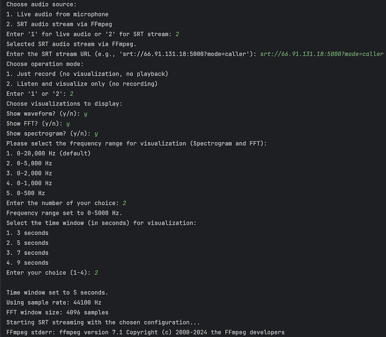
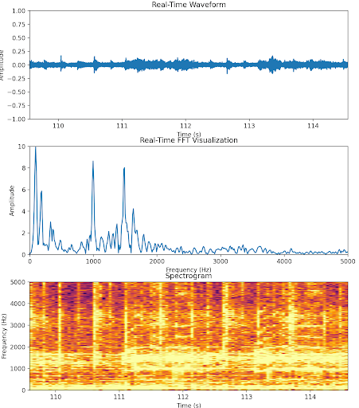

# Advanced SRT & Microphone Audio Visualization and Recording

This project provides an efficient, extensible Python script for:
1. **Streaming** audio via SRT (Secure Reliable Transport).
2. **Recording** microphone or SRT audio to a WAV file.
3. **Visualizing** audio data in real-time (waveform, FFT, and spectrogram) with Matplotlib.
4. **Playing** live streamed audio through speakers.

The code is designed to handle various modes (record-only, visualize-only, and full playback) with minimal user intervention, while keeping performance in mind for continuous data streams.

---

## Table of Contents
- [Overview](#overview)
- [Key Features](#key-features)
- [Architecture](#architecture)
- [Usage](#usage)
- [Performance Considerations](#performance-considerations)
- [Future Improvements](#future-improvements)
- [License](#license)

---

## Overview
The goal of this project is to offer a **flexible** yet **highly efficient** way of handling audio input from both a local microphone and remote SRT streams. The script allows users to:

- Connect to a remote SRT address, capture incoming audio, and optionally record or visualize it.
- Use a local microphone for real-time capturing, either to record or to visualize, or both.
- Maintain a lightweight, fast main loop to minimize delays and lags.

**Core Python libraries used include**:
- [sounddevice](https://pypi.org/project/sounddevice/) for local microphone streaming
- [pyaudio](https://pypi.org/project/PyAudio/) for playback
- [wave](https://docs.python.org/3/library/wave.html) for WAV file I/O
- [matplotlib](https://pypi.org/project/matplotlib/) for real-time plotting
- [queue, threading, subprocess] from the standard library for concurrency and SRT streaming via FFmpeg

---

## Key Features

1. **Multiple Audio Sources**
    - **Microphone**: Streams live audio from the system’s default recording device.
    - **SRT**: Connects to a remote SRT server using FFmpeg, handling packet buffering, jitter, etc.

2. **Multiple Operation Modes**
    - **Record Only**: Saves raw audio (16-bit PCM) to a WAV file without visualizing or playing it.
    - **Visualize Only**: Displays live waveform, FFT, and/or spectrogram with no file I/O.
    - **Record + Visualize + Playback**: Combines all features, letting users see, hear, and record simultaneously.

3. **Robust Real-Time Visualization**
    - **Waveform**: Displays the amplitude vs. time graph.
    - **FFT Plot**: Shows frequency components in near real-time.
    - **Spectrogram**: Visualizes frequency intensity over a rolling time window.

4. **Flexible Configuration**
    - **Sample Rate**: Dynamically determined or set for consistent FFT sizing.
    - **FFT Window Size**: Chosen to achieve a balance between frequency resolution and real-time responsiveness.
    - **Frequency and Time Window**: User can specify the range for FFT or spectrogram (e.g., 0–20 kHz).

5. **Optimized Performance**
    - Uses separate threads for audio reading, writing, and visualization to reduce blocking.
    - Employs a minimal logic loop for reading SRT or mic data, offloading visualization and file I/O to queues and threads where possible.

---

## Architecture

```mermaid
flowchart LR
    A[Audio Source\n(Mic or SRT)] --> B[Main Loop\n(Minimal overhead)]
    B -->|Audio Data| C[Audio Callbacks]
    C -->|Enqueue Data| D[Queue\nraw_audio_queue / fft_queue / etc.]
    D --> E[Recording Thread\n(WAV) / Visualization Loop\n(Matplotlib)]
    E -->|Periodic Updates| F[Plots / WAV File]
```

---

## Demonstration of Interactivity



> **Figure 1**: CLI-based user prompts. Here, a remote SRT source is chosen for “listen and visualize only.” The user then specifies which plots to render (Waveform, FFT, Spectrogram), sets a frequency window (e.g., 0–5 kHz), and picks a 5-second time window.

---

## Final Visualization Example



> **Figure 2**: All three plots in action: **Waveform** (top), **FFT** amplitude vs. frequency (middle), and **Spectrogram** (bottom). Each plot updates continuously, providing real-time insights into the incoming audio signal.

---

## Additional Context

[**Remote Monitoring of Coral Reef Underwater Sounds**](../img/Remote%20Monitoring%20of%20Coral%20Reef%20Underwater%20Sounds.pdf)

> **Figure 3**: A presentation poster (PDF) illustrating the application of SRT streaming in marine environmental monitoring, enabling remote acoustic data gathering and real-time auditory feedback.

*(Note: GitHub or certain hosting platforms might not embed the PDF directly; it may appear as a downloadable link.)*

---

## Performance Considerations

- **Threaded Approach**: The script decouples the main loop from WAV writing and plot updates, keeping the central data pipeline uninterrupted.  
- **Asynchronous Visualization**: Matplotlib is leveraged in an interactive mode; calls like `draw_idle()` or `flush_events()` run on separate intervals, avoiding heavy overhead in the main loop.  
- **Minimal I/O in the Callback**: Data is queued for writing or plotting rather than processed in-place, lowering real-time CPU load.

---
